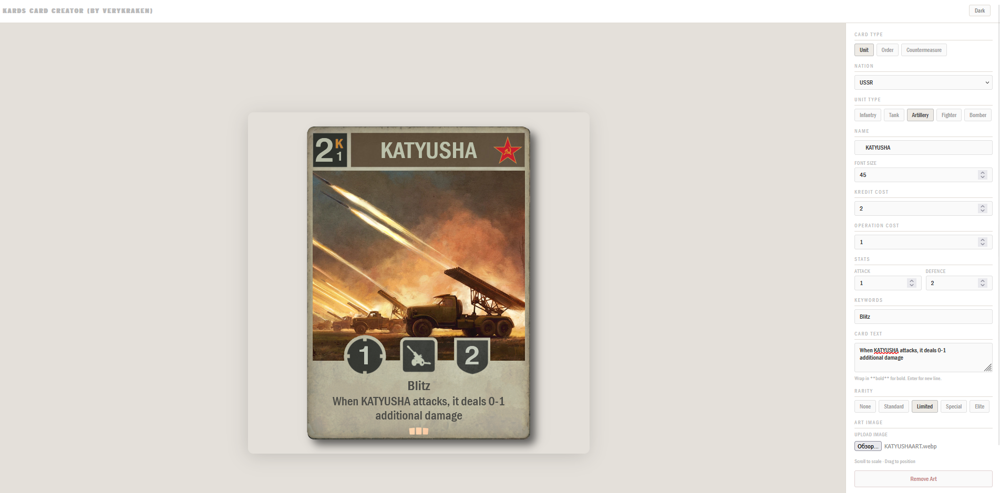
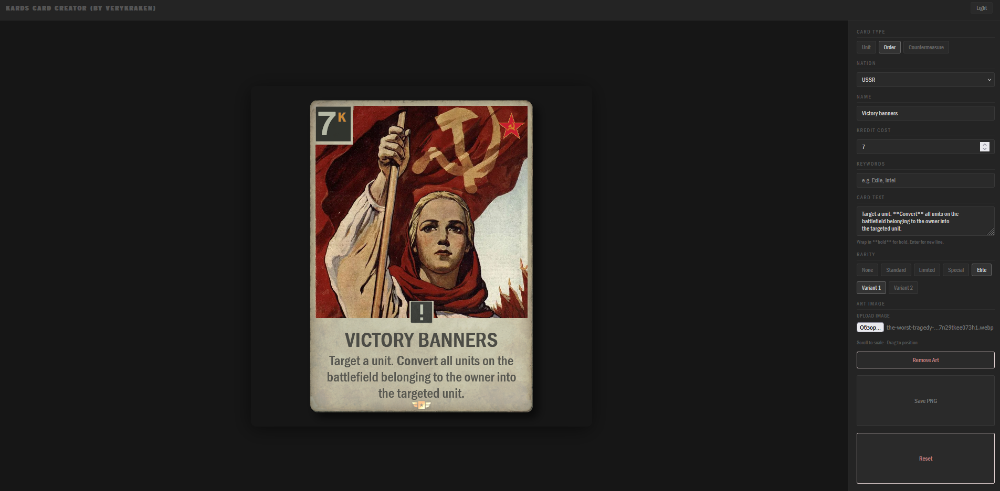

# KARDS Card Builder

A fan-made collection of card templates for the **[KARDS](https://www.kards.com/)**, along with a standalone card creator tool.

> **Disclaimer:** This is an unofficial fan project and is not affiliated with or endorsed by 1939 Games.

---

## Preview




---

## Card Creator (creator.html)

A fully **self-contained** card creator that runs directly in any browser. All card templates, nation headers, rarity icons, and fonts are embedded directly into the file as **Base64 data**, so the single `.html` file is all you need.

**Features:**
- Unit cards (Infantry, Tank, Artillery, Fighter, Bomber) with all nations
- Order & Countermeasure cards
- Custom card name, stats, keywords, and card text (with **bold** markdown support)
- Rarity icons (Standard, Limited, Special, Elite)
- Art image upload — drag to reposition, scroll to scale, clipped to the art area
- Scroll to zoom the full card preview (up to 2×)
- Export as PNG

---

## File Structure

```
KARDS_card_builder/
│
├── creator.html                        # Standalone card creator (open in browser)
│
├── Fonts/
│   ├── Franklin Gothic Book Regular.ttf
│   ├── Franklin Gothic Condensed.ttf
│   ├── Franklin Gothic Medium Cond Regular.ttf
│   └── helvetica-now-text-medium.ttf
│
└── Templates/
    │
    ├── Units/
    │   ├── infantry.png
    │   ├── tank.png
    │   ├── artillery.png
    │   ├── fighter.png
    │   ├── bomber.png
    │   └── Headers/                    # Nation + unit type header banners
    │       ├── germany_ground.jpg
    │       ├── germany_air.jpg
    │       ├── ussr_ground.jpg
    │       ├── ussr_air.jpg
    │       ├── usa_ground.jpg
    │       ├── usa_air.jpg
    │       ├── britain_ground.jpg
    │       ├── britain_air.jpg
    │       ├── poland_ground.jpg
    │       ├── poland_air.jpg
    │       ├── france_ground.jpg
    │       ├── france_air.jpg
    │       ├── japan_ground.jpg
    │       ├── japan_air.jpg
    │       ├── finland_ground.jpg
    │       ├── finland_air.jpg
    │       ├── italy_ground.jpg
    │       ├── italy_air.jpg
    │       ├── anzac_ground.jpg
    │       ├── anzac_air.jpg
    │       └── neutral.jpg
    │
    ├── Orders_Countermeasures/
    │   ├── order.png
    │   ├── countermeasure.png
    │   └── nations/                    # Nation logos for Orders & Countermeasures
    │       ├── germany.png
    │       ├── ussr.png
    │       ├── usa.png
    │       ├── britain.png
    │       ├── poland.png
    │       ├── france.png
    │       ├── japan.png
    │       ├── finland.png
    │       ├── italy.png
    │       ├── anzac.png
    │       └── neutral.png
    │
    └── Rarity/
        ├── standard.png
        ├── limited.png
        ├── special_1.png
        ├── special_2.png
        ├── elite_1.png
        └── elite_2.png
```

---

## Usage

Simply open `creator.html` in your browser. No setup required.