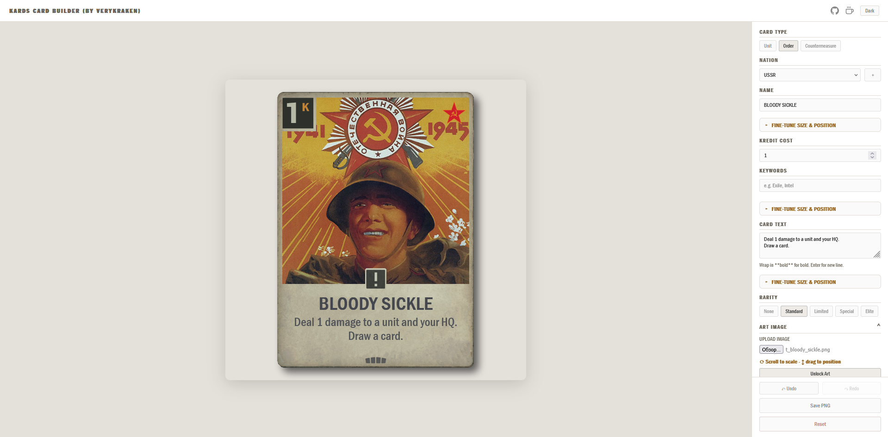
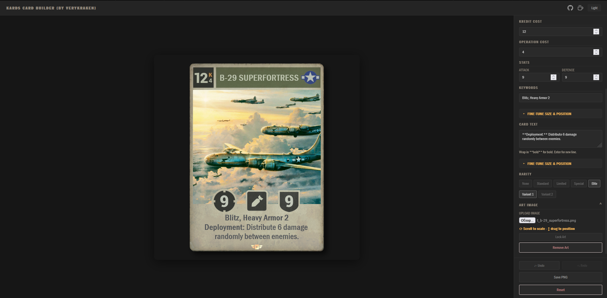

# KARDS Card Builder

A fan-made collection of card templates for **[KARDS](https://www.kards.com/)**, along with a standalone card creator tool.

> **Disclaimer:** This is an unofficial fan project. KARDS Card Builder was created under 1939 Games’ "Community content policy" policy using assets owned by 1939 Games. 1939 Games does not endorse or sponsor this project.

---

## Usage

**[Open KARDS Card Builder →](https://babaika328.github.io/KARDS-Card-Builder/)**

Alternatively, download and open `index.html` locally. No installation or setup required.

---

[](https://buymeacoffee.com/verykraken)

## Preview




---

## Card Creator (index.html)

A fully **self-contained** card creator that runs directly in any browser. All card templates, nation headers, rarity icons, and fonts are embedded directly into the file as **Base64 data**, so the single `.html` file is all you need.

**Features:**
- Unit cards (Infantry, Tank, Artillery, Fighter, Bomber) with all nations
- Order & Countermeasure cards
- Custom card name, stats, keywords, and card text (with **bold** markdown support)
- Rarity icons (Standard, Limited, Special, Elite)
- Art image upload — drag to reposition, scroll/pinch to scale, lock/unlock, clipped to the art area
- Scroll or pinch to zoom the full card preview (up to 5×)
- Undo / Redo (buttons + Ctrl+Z / Ctrl+Y)
- Dark / Light theme
- Export as PNG

---

## File Structure

```
KARDS_card_builder/
│
├── index.html                        # Standalone card creator (open in browser)
│
├── Fonts/
│   ├── Franklin Gothic Book Regular.ttf
│   ├── Franklin Gothic Condensed.ttf
│   ├── Franklin Gothic Medium Cond Regular.ttf
│   ├── Roboto Black.ttf
│   └── Roboto-BoldCondensed.ttf
│
└── Templates/
    │
    ├── Units/
    │   ├── artillery.png
    │   ├── artillery_2.png
    │   ├── bomber.png
    │   ├── bomber_2.png
    │   ├── fighter.png
    │   ├── fighter_2.png
    │   ├── infantry.png
    │   ├── infantry_2.png
    │   ├── tank.png
    │   ├── tank_2.png
    │   └── Headers/                    # Nation + unit type header banners
    │       ├── anzac_air.jpg
    │       ├── anzac_ground.jpg
    │       ├── britain_air.jpg
    │       ├── britain_ground.jpg
    │       ├── finland_air.jpg
    │       ├── finland_ground.jpg
    │       ├── france_air.jpg
    │       ├── france_ground.jpg
    │       ├── germany_air.jpg
    │       ├── germany_ground.jpg
    │       ├── italy_air.jpg
    │       ├── italy_ground.jpg
    │       ├── japan_air.jpg
    │       ├── japan_ground.jpg
    │       ├── neutral.jpg
    │       ├── poland_air.jpg
    │       ├── poland_ground.jpg
    │       ├── usa_air.jpg
    │       ├── usa_ground.jpg
    │       ├── ussr_air.jpg
    │       └── ussr_ground.jpg
    │
    ├── Orders_Countermeasures/
    │   ├── countermeasure.png
    │   ├── countermeasure_2.png
    │   ├── order.png
    │   ├── order_2.png
    │   └── nations/                    # Nation logos for Orders & Countermeasures
    │       ├── anzac.png
    │       ├── britain.png
    │       ├── finland.png
    │       ├── france.png
    │       ├── germany.png
    │       ├── italy.png
    │       ├── japan.png
    │       ├── neutral.png
    │       ├── poland.png
    │       ├── usa.png
    │       └── ussr.png
    │
    └── Rarity/
        ├── elite_1.png
        ├── elite_2.png
        ├── limited.png
        ├── special_1.png
        ├── special_2.png
        └── standard.png

```